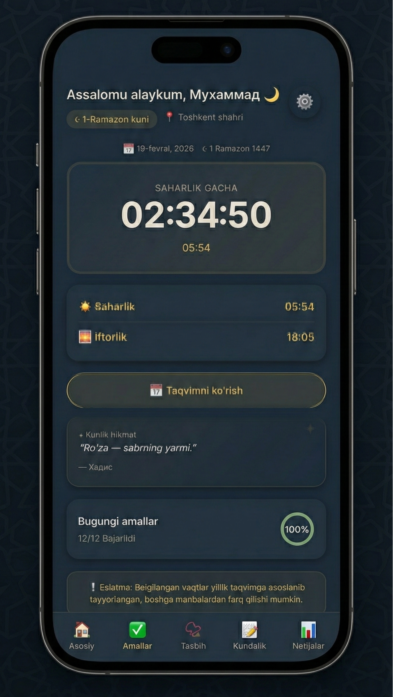
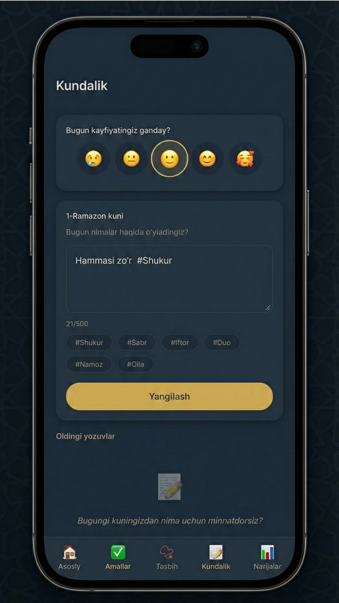

# 🌙 Ramazon Kundaligi - Telegram Mini App (Showcase)

*Note: This repository is a portfolio showcase. The source code is closed-source as it is a live production app.*

👉 **[Live Demo: Open Telegram Bot](https://t.me/Ramazonkundaligi_robot)** 

**🌙 Ramazon Kundaligi** is a highly interactive, beautifully designed Telegram Mini App (Web App) built to help users manage their daily routines during the holy month of Ramadan. It seamlessly integrates into Telegram, offering a native app-like experience without requiring any downloads.

## 📸 App Screenshots

| Home  | Diary | Achievements |
|:---:|:---:|:---:|
|  |  |  |

---

## ✨ Key Features

* **📍 Localized Prayer Times:** Automatically displays accurate Suhoor and Iftar times based on the user's selected region in Uzbekistan.
* **📿 Smart Digital Tasbih:** Interactive UI with haptic feedback (vibration) to track daily dhikr.
* **📖 Daily Habit Tracker:** Allows users to log fasting, prayers, and daily good deeds.
* **🎁 Viral Referral System:** Built-in "Invite 5 Friends" logic using Telegram's `start_param` to auto-unlock Premium features.
* **💳 Serverless Payments:** Users can manually purchase Premium, and the system forwards the receipt securely to the Admin with auto-filled User IDs.
* **📸 Native Story Sharing:** Integrates `Telegram.WebApp.shareToStory` to let users share their achievements directly to Telegram Stories with custom branded backgrounds.

## 🧠 Smart Serverless Architecture

What makes this app special is its **Zero-Cost, Serverless Architecture**. 

Instead of deploying a traditional Node.js or Python backend, the app uses **Google Apps Script + Google Sheets** as a lightweight REST API and Database.
* **Frontend:** Vanilla HTML5, CSS3, JavaScript (Vite optimized for fast loading).
* **Database:** Google Sheets (Stores User IDs, Referral Counts, Premium Status).
* **API:** Google Apps Script handles `GET/POST` requests from the Telegram Web App, updates the spreadsheet, and calculates referral milestones.
* **Broadcasting:** The Admin can trigger broadcast messages to all users directly from the Google Sheets custom menu!

## 👨‍💻 Product Owner & Developer
**[Muhammad Islamov]** Passionate about building seamless, UI/UX-focused Telegram Mini Apps and clever serverless solutions.
